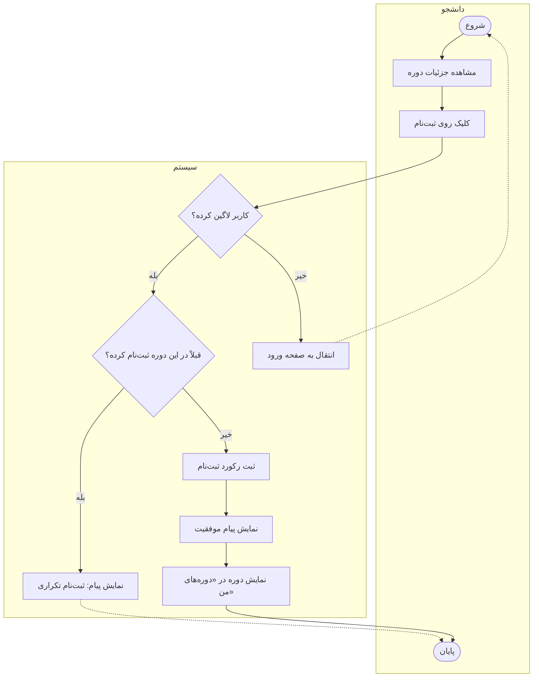
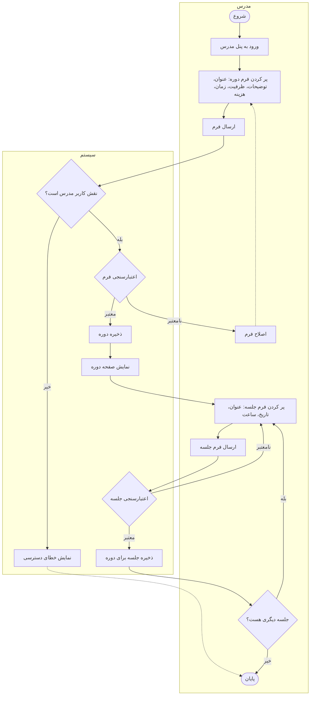
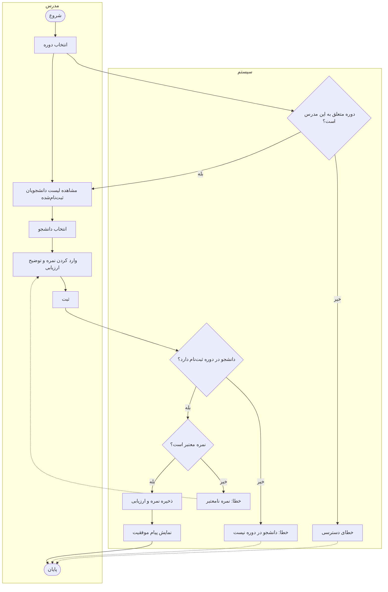

**۱) ثبت‌نام دانشجو در دوره**

```mermaid
flowchart TD
    subgraph S["دانشجو"]
        A([شروع]) --> B[مشاهده جزئیات دوره]
        B --> C[کلیک روی ثبت‌نام]
        I([پایان])
    end
    subgraph SYS["سیستم"]
        D{کاربر لاگین کرده؟}
        E{قبلاً در این دوره ثبت‌نام کرده؟}
        F[ثبت رکورد ثبت‌نام]
        G[نمایش پیام موفقیت]
        H[نمایش دوره در «دوره‌های من»]
        X1[انتقال به صفحه ورود]
        X2[نمایش پیام: ثبت‌نام تکراری]
    end
    C --> D
    D -- خیر --> X1 -.-> A
    D -- بله --> E
    E -- بله --> X2 -.-> I
    E -- خیر --> F --> G --> H --> I
```

**۲) ایجاد دوره و جلسات توسط مدرس**

```mermaid
flowchart TD
    subgraph T["مدرس"]
        A([شروع]) --> B[ورود به پنل مدرس]
        B --> C[پر کردن فرم دوره: عنوان، توضیحات، ظرفیت، زمان، هزینه]
        C --> D[ارسال فرم]
        K[اصلاح فرم]
        L[پر کردن فرم جلسه: عنوان، تاریخ، ساعت]
        M[ارسال فرم جلسه]
        N{جلسه دیگری هست؟}
        P([پایان])
    end
    subgraph SYS["سیستم"]
        E{نقش کاربر مدرس است؟}
        F{اعتبارسنجی فرم}
        G[ذخیره دوره]
        H[نمایش صفحه دوره]
        Q[نمایش خطای دسترسی]
        R{اعتبارسنجی جلسه}
        S[ذخیره جلسه برای دوره]
    end
    D --> E
    E -- خیر --> Q -.-> P
    E -- بله --> F
    F -- نامعتبر --> K -.-> C
    F -- معتبر --> G --> H --> L --> M --> R
    R -- نامعتبر --> L
    R -- معتبر --> S --> N
    N -- بله --> L
    N -- خیر --> P
```

**۳) ثبت نمره/ارزیابی دانشجو توسط مدرس**

```mermaid
flowchart TD
    subgraph T["مدرس"]
        A([شروع]) --> B[انتخاب دوره]
        B --> C[مشاهده لیست دانشجویان ثبت‌نام‌شده]
        C --> D[انتخاب دانشجو]
        D --> E[وارد کردن نمره و توضیح ارزیابی]
        E --> F[ثبت]
        Z([پایان])
    end
    subgraph SYS["سیستم"]
        G{دوره متعلق به این مدرس است؟}
        H{دانشجو در دوره ثبت‌نام دارد؟}
        I{نمره معتبر است؟}
        J[ذخیره نمره و ارزیابی]
        K[نمایش پیام موفقیت]
        X1[خطای دسترسی]
        X2[خطا: دانشجو در دوره نیست]
        X3[خطا: نمره نامعتبر]
    end
    B --> G
    G -- خیر --> X1 -.-> Z
    G -- بله --> C
    F --> H
    H -- خیر --> X2 -.-> Z
    H -- بله --> I
    I -- خیر --> X3 -.-> E
    I -- بله --> J --> K --> Z
```